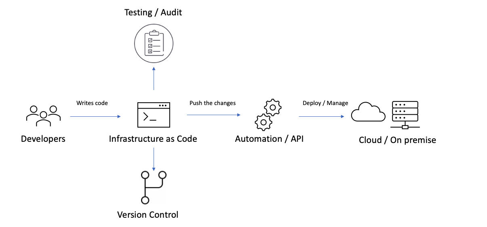
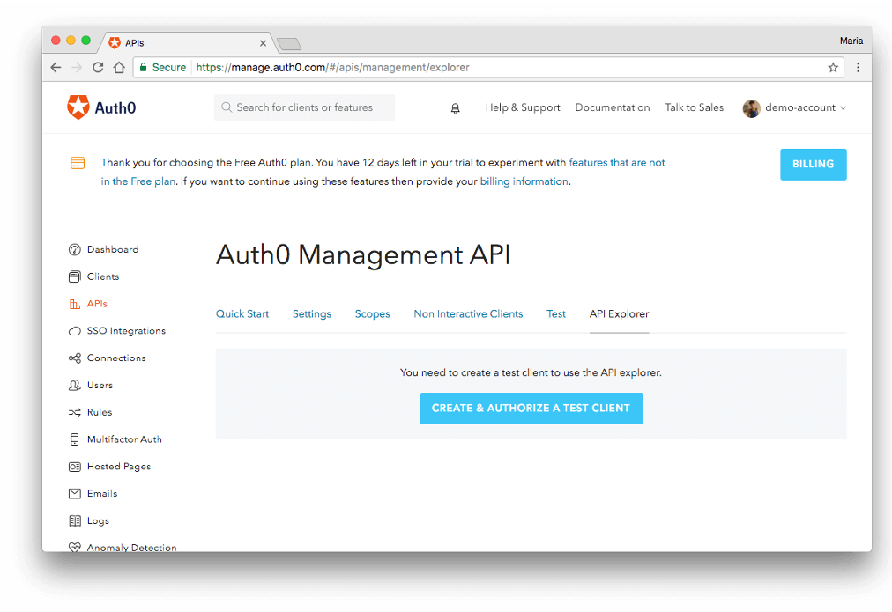
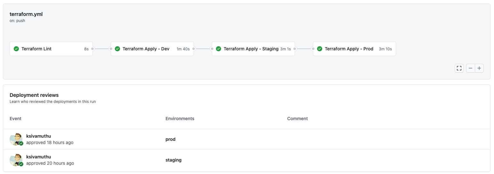

# Auth0 - Identity Infrastructure as Code

## What is Infrastructure as Code?

Infrastructure as Code (IaC) is the management of infrastructure in a descriptive model, using the same versioning as DevOps team uses for source code. **Microsoft**

* Write the infrastructure spec in descriptive code.
* Integrate into Source Control 
* Share across & Deploy different environments
* Manage and Provision infrastructure in Cloud / On-premise.

## How Infrastructure as Code works?

* Developers write code
* Version Control
* Test / Audit the code and infrastructure
* Automation & API pulls the code and deploys
* Provision and Manage Cloud / On Premise infrastructure

## Benefits of IaC

* Faster time to production and market
* Improved Consistency
* Less configuration drift
* Reusable code
* Faster and more efficient development
* Lower cost and more time on developing innovations.

## Auth0 - Identity Infrastructure as Code
> Identity, Authentication, Authorization & Extensibility.

Auth0 is an easy to implement, adaptable authentication and authorization platform. 

[https://auth0.com](https://auth0.com)

## Auth0 Dashboard & Management API

You can create the Auth0 resources in dashboard. As we are talking about the infrastructure as code, the management API can be used to manage the tenant, applications, apis, extensions and more.

Anything the Auth0 dashboard can do, the management API can do as well.

## Infrastructure as Code Tools to setup Auth0

### 1. Auth0 - Deploy CLI

Auth0 supports continuous integration and deployment (CI/CD) of Auth0 Tenants through source control extensions and integration into existing CI/CD pipelines by using this auth0-deploy-cli tool.

The auth0-deploy-cli tool supports the importing and exporting of Auth0 Tenant configuration data. The auth0-deploy-cli tool leverages the Auth0 Management API passing through objects for creates, updates and deletions.

Reference:

* https://auth0.com/docs/extensions/github-deployments
* https://github.com/auth0/auth0-deploy-cli

### 2. Auth0 - Terraform 

The Auth0 provider is used to interact with Auth0 applications and APIs. It provides resources that allow you to create and manage clients, resource servers, client grants, connections, email providers and templates, rules and rule variables, users, roles, tenants, and custom domains as part of a Terraform deployment.

Reference:
* https://registry.terraform.io/providers/alexkappa/auth0/latest/docs

### 3. Auth0 - Pulumi

The Auth0 provider for Pulumi can be used to provision any of the cloud resources available in Auth0. The Auth0 provider must be configured with credentials to deploy and update resources in Auth0. You can write the infrastructure as code in any language such as Javascript, Typescript, C#, Go, Python and more.

Reference:
* https://www.pulumi.com/docs/intro/cloud-providers/auth0/
* https://www.pulumi.com

## Github Actions (Environment & Reviewing Deployments)

Reference:

* https://docs.github.com/en/free-pro-team@latest/actions/reference/environments
* https://docs.github.com/en/free-pro-team@latest/actions/managing-workflow-runs/reviewing-deployments
